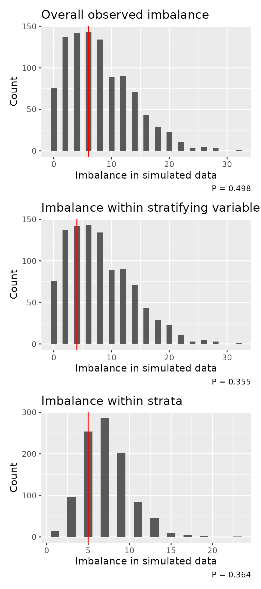

# Assessing imbalance

When running a trial, it may be useful to periodically check how well
balanced the randomisation is. This is especially true where procedures
relying on random elements such as minimization are used instead of
pre-defined randomisation lists.

`randotools` provides a couple of tools to assist in assessing how well
balanced the randomisation has been performed.

``` r
library(randotools)
```

### Dataset

As an example, we will use a dataset that is included within the
package:

``` r
data(rando_balance)
summary(rando_balance)
#>      strat1        strat2     rando_res          rando_res2       
#>  Min.   :0.0   Min.   :0.0   Length:100         Length:100        
#>  1st Qu.:0.0   1st Qu.:0.0   Class :character   Class :character  
#>  Median :0.5   Median :0.5   Mode  :character   Mode  :character  
#>  Mean   :0.5   Mean   :0.5                                        
#>  3rd Qu.:1.0   3rd Qu.:1.0                                        
#>  Max.   :1.0   Max.   :1.0
```

The dataset contains four variables:- two stratification variables, and
two randomisation variables. One randomisation variable, `rando_res` has
balanced randomisation. The other, `rando_res2`, has a small degree of
imbalance.

``` r
table(rando_balance$rando_res)
#> 
#> trt1 trt2 
#>   50   50
table(rando_balance$rando_res2)
#> 
#> trt1 trt2 
#>   53   47
```

### Sequential plots

The `imbalance_seq_plots` function aids in plotting the imbalance as a
function of randomisation number (assuming that the data is sorted from
oldest to newest).

This function produces up to 6 plots, so the `patchwork` package comes
in useful for combining the plots via `wrap_plots`.

``` r
library(patchwork)
imbalance_seq_plots(rando_balance, 
                    randovar = "rando_res") |> 
  wrap_plots(ncol = 2)
```


On the left we see the balance in the observed data. On the right, we
see a simulated dataset with completely random assignment. We would
generally want the observed curve to be below that of the randomly
generated data.

Where stratification variables are included, additional plots are shown
with lines for each level of the the stratification variable(s) (the
second row) and the specific strata (the combination of each
stratification variable; the last row).

``` r
imbalance_seq_plots(rando_balance, 
                    randovar = "rando_res",
                    stratavars = c("strat1", "strat2")) |> 
  wrap_plots(ncol = 2)
```


### Testing imbalance

We also provide a permutation-type test, and accompanying plot, for
comparing the observed randomisation imbalance with multiple simulated
datasets. The null hypothesis for the test is that imbalance is lower or
equal in the random data than relative to observed data. As such, we
want a small p-value.

``` r
imb <- imbalance_test(rando_balance, 
                      randovar = "rando_res2",
                      stratavars = c("strat1", "strat2"))
imb
#> Randomisations to date: 100 
#> Overall imbalance: 6 
#>   Probability of equal or less imbalance from random allocation: 0.498 
#> 
#> Randomisation stratified by strat1 and strat2 
#> Maximum observed imbalanced within stratifying variables: 4 
#>   Probability of equal or less imbalance from random allocation: 0.355 
#> Maximum observed imbalanced within individual strata: 5 
#>   Probability of equal or less imbalance from random allocation: 0.364
```

The corresponding plots show the frequency of imbalance values in the
random datasets (the bars). The red vertical line indicates that from
the observed data. Ideally, the observed line would be to the left of
the plot. The p-value is indicated bottom right.

``` r
imbalance_test_plot(imb)
```


